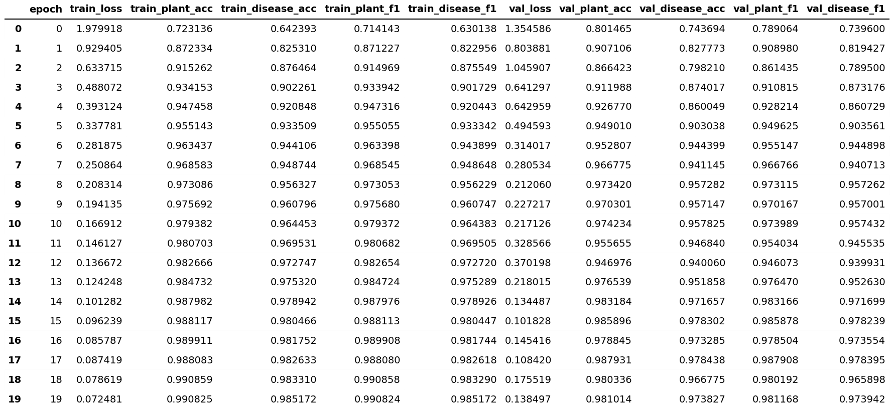
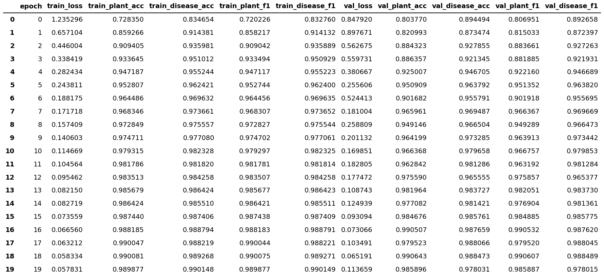

## Plant Disease Classification: Flat vs Hierarchical Architectures

### Overview

This project investigates the performance differences between two deep learning architectures for plant and disease classification:

- Flat architecture
- Hierarchical architecture
  Both models use a ResNet-18 backbone trained from scratch

### Architecture Design

### Flat Architecture

The flat model follows a multi-label classification approach. A single network is trained to predict both the plant type and the disease simultaneously from the same feature representation.

While this approach is simple and efficient, it does not explicitly model the dependency between plant type and disease. As a result, the model may produce inconsistent predictions, such as assigning a disease to a plant that cannot exhibit it.

### Hierarchical Architecture

The hierarchical model introduces a structured prediction pipeline.

First, the ResNet-18 backbone extracts a compact feature representation from the input image. These features are then passed to a plant classification head, which predicts the plant type.

Based on the predicted plant, the features are routed to a plant-specific disease classifier. Each plant category has its own dedicated disease prediction head.

This design ensures that disease predictions are conditioned on the plant type, leading to more biologically consistent outputs.

### Results

### Key Findings

The experiments reveal several important insights:

- The flat model can occasionally achieve competitive or slightly higher performance in plant classification. However, its performance on disease classification is highly unstable and, in some cases, drops significantly.
- The hierarchical model demonstrates consistent performance across both plant and disease prediction tasks. Across all benchmark test sets, the hierarchical architecture outperforms the flat model, particularly in disease classification.

### Intepretation

The main limitation of the flat model is that it attempts to learn plant and disease relationships jointly without enforcing any structural constraints.

In contrast, the hierarchical model decomposes the problem into two stages:

- Identify the plant type
- Predict the disease conditioned on that plant

This structured approach reduces invalid predictions and improves generalization across datasets.
